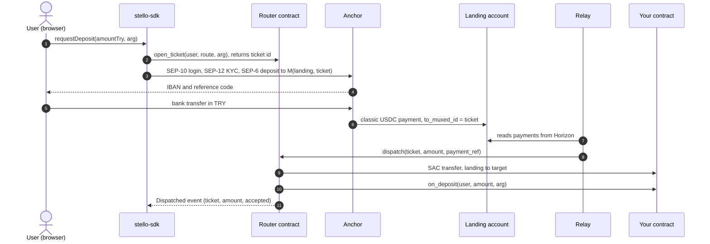
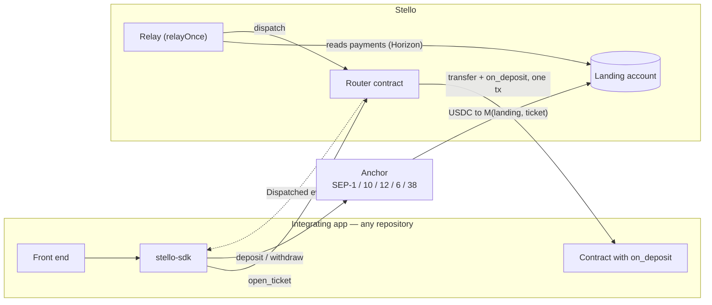

<div align="center">

# Stello

**A bank transfer is a contract call.**

Let people who have never installed a crypto wallet use your Soroban contract.
They send an ordinary bank transfer; your contract is called with the money already in it.

[](https://www.npmjs.com/package/stello-sdk)
[](LICENSE)
[](https://stellar.expert/explorer/testnet/contract/CAG2IZHZK6VLNW3ASXENFLCL6SN6KS72JMLNF4GO2ZIFV5WURN2BYFZV)

### → [stello-web-rho.vercel.app](https://stello-web-rho.vercel.app/en)

[Documentation](https://stello-web-rho.vercel.app/en/docs) ·
[For coding agents](https://stello-web-rho.vercel.app/llms-full.txt) ·
[npm](https://www.npmjs.com/package/stello-sdk) ·
[Türkçe](https://stello-web-rho.vercel.app/tr)

</div>

---

## Two links, and they are not the same thing

|  |  |
| --- | --- |
| **Stello** — the layer itself: the SDK, the router contract and the developer documentation. This repository. | **[stello-web-rho.vercel.app](https://stello-web-rho.vercel.app/en)** |
| **Stello Campaign** — *an application someone built with Stello.* Its own repository, its own contract, installing `stello-sdk` from npm like anyone else would. A demonstration of the layer, not part of it. | [stello-core-et2a.vercel.app](https://stello-core-et2a.vercel.app) |

If you are here to integrate Stello, the first link is the one you want. The second is there
to show that a completely separate project can consume this as a package — which is the
difference between a layer and an application.

## Submission at a glance

| Deliverable | Where |
| --- | --- |
| Public repository — the layer | [github.com/sayweer/stello](https://github.com/sayweer/stello) (this repository) |
| Public repository — the example app | [github.com/sayweer/stello-kampanya](https://github.com/sayweer/stello-kampanya) |
| Front-end URL | <https://stello-web-rho.vercel.app> — developer site and documentation |
| Working live demo | <https://stello-core-et2a.vercel.app> — see [Live demo](#live-demo) |
| Smart contracts on Stellar testnet | [Router](https://stellar.expert/explorer/testnet/contract/CAG2IZHZK6VLNW3ASXENFLCL6SN6KS72JMLNF4GO2ZIFV5WURN2BYFZV) · [Example target](https://stellar.expert/explorer/testnet/contract/CDF6WDCS3M36RN6ERREM4B5ZT74RL5SU3I2TLJ2JXB5DCODMHPP266UH) · [Campaign](https://stellar.expert/explorer/testnet/contract/CC5OFUN4SOUJLXQ6N45SHWRUXX5BRHOS5ONN4P3FQYTU6WFS5BOAKRHV) |
| Published package | [`stello-sdk@0.1.0`](https://www.npmjs.com/package/stello-sdk) on npm |
| Contract IDs and artifacts | [Deployed contracts and artifacts](#deployed-contracts-and-artifacts) · [`deployments/`](deployments) |
| Pitch deck — official hackathon template | [Stello — Stellar Pro Hackathon](https://drive.google.com/file/d/1RLxrJtn_kFELrM85B87cFykrQEnnPXmg/view?usp=drive_link) |
| Integrated by another team | [Lumen Gate](https://github.com/lubothebook/lumen-gate) — see [Who is building with Stello](#who-is-building-with-stello) |

Where each submission requirement is answered:

| Requirement | Answered in |
| --- | --- |
| 1. The narrative "why" | [Why](#why) — what we are building, the problem, target users, why it is worth solving, value proposition |
| 2. The MVP | the table above · [Live demo](#live-demo) · [Deployed contracts and artifacts](#deployed-contracts-and-artifacts) — every contract is written with the Soroban SDK and live on Stellar testnet, with reproducible wasm hashes |
| 3. Technical documentation | [Architecture](#architecture) · [Components](#components-and-responsibilities) · [Stellar integrations](#stellar-integrations-and-protocols) · [Design decisions](#key-design-decisions-and-trade-offs) · [Technical challenges](#technical-challenges-and-how-they-were-solved) |
| 4. Pitch presentation | the deck linked above, built on the official Stellar Pro Hackathon template |

**Contents:** [Why](#why) · [How it works](#how-it-works) ·
[The whole integration](#the-whole-integration) · [Live demo](#live-demo) ·
[Who is building with Stello](#who-is-building-with-stello) ·
[Deployed contracts](#deployed-contracts-and-artifacts) · [Architecture](#architecture) ·
[Contract reference](#contract-reference) ·
[Stellar integrations](#stellar-integrations-and-protocols) ·
[Design decisions](#key-design-decisions-and-trade-offs) ·
[Technical challenges](#technical-challenges-and-how-they-were-solved) ·
[Trust model](#trust-model) · [Known limits](#known-limits-and-roadmap) ·
[Development](#development)

---

## Why

### What we are building

Stello is an integration layer between a fiat anchor and any Soroban contract. It turns an
ordinary bank transfer into a contract call: the user pays an IBAN from the banking app they
already have, and the integrating contract's `on_deposit(user, amount, arg)` runs with the
money already inside it. The way back exists too — USDC the contract pays out becomes lira in
the user's own bank account.

It ships as three things: a shared **router contract**, a **relay**, and **`stello-sdk`** on
npm. An app integrates with one contract function, one route registration and one package.

### The problem

A Soroban contract can only be used by someone who already has a wallet, some XLM for fees
and a way to get money on chain. For most people in most places, that is three walls before
the product even starts. The usual answer — "tell them to install a wallet" — is the reason
so many good contracts have no users.

Anchors solve the fiat half of this, but they stop one step short of the contract:

1. **An anchor pays accounts, not contracts.** The sandbox anchor rejects a contract address
   outright: `'account' must be a Stellar G... or M... address (contract addresses are not supported)`.
2. **Even where a deposit to a contract address is possible, nothing happens.** SEP-6 permits
   `C...` accounts and SEP-45 can authenticate them, but tokens arriving at a contract do not
   invoke a function. The money is there; the pledge, the ticket, the savings entry is not.

So every team that wants bank-funded users ends up building the same private bridge inside
its own app — a landing account, a watcher, an attribution scheme — and none of it is
reusable. Cross-chain USDC already has this primitive (CCTP's forwarder and hook). Fiat does
not. Stello is *deposit-and-call* for fiat.

### Target users

- **Teams building on Soroban** that want users who do not own crypto. They are the customer:
  they add `on_deposit`, register a route, install the SDK.
- **Their end users**: people with a bank account and no wallet. They see an IBAN, a reference
  code and lira amounts — never a seed phrase, an exchange or a token name.
- **The first concrete audience**, served by the example app: people organising things that
  only happen "if enough of us join" — trips, workshops, group purchases — which today run on
  a chat group, a personal IBAN and a spreadsheet, with refunds done by hand.

### Why it is worth solving

The anchor network is Stellar's strongest asset and Soroban is its newest one, and today they
do not compose: an anchor's output is a payment to an account, and a contract's input is an
authorised invocation. Closing that gap once, as shared infrastructure, means every Soroban
app gains a fiat front door without its team learning SEP-10, SEP-12, SEP-6, muxed accounts
and a relay's failure modes.

### Value proposition

- **For a developer:** one function, one route, one package, instead of building and
  operating a private bank-to-contract bridge.
- **For a user:** no wallet to install, no seed phrase, no XLM to buy. A bank transfer in, a
  bank transfer out.
- **For the ecosystem:** anchor volume that ends in contract state instead of an idle balance.

> **What "no wallet" means, precisely.** Every Soroban transaction needs a source account, and
> Stello does not pretend otherwise. The SDK generates a keypair in the browser, funds it,
> adds the USDC trustline and signs in to the anchor, all invisibly. The user has an account;
> what they do not have is a wallet app, a seed phrase to write down, or a reason to know what
> XLM is. Two keys ever sign: the user's (opening a ticket, cashing out) and the relay's
> (dispatching).

---

## How it works



1. **A ticket is opened.** The user's key signs `open_ticket`; the router stores the user, the
   route and up to 64 bytes of the app's own argument, and returns a `u64` ticket id.
2. **The anchor returns payment details.** The SDK asks the anchor (SEP-6) for a deposit to
   the [muxed address][muxed] `M(landing, ticket)`. The user sees an IBAN and a reference.
3. **The payment lands.** The anchor pays USDC to the landing account, and Horizon records the
   operation with `to_muxed_id = ticket`. That id is what ties an anonymous bank transfer to a
   specific user, route and argument — on chain, with no database.
4. **The router dispatches.** The relay calls `router.dispatch`, which moves the USDC to the
   target and calls `on_deposit` in the **same transaction** — so the money and the call
   either both happen or neither does.
5. **The way out.** Whatever the contract later pays the user (a refund, a payout, a
   withdrawal) arrives in their account as USDC; `withdrawToIban` turns it into lira through
   a SEP-6 withdrawal.

[muxed]: https://github.com/stellar/stellar-protocol/blob/master/ecosystem/sep-0023.md

## The whole integration

**One function in your contract:**

```rust
pub fn on_deposit(env: Env, user: Address, amount: i128, arg: Bytes) -> bool {
    let router: Address = env.storage().instance().get(&DataKey::Router).unwrap();
    router.require_auth();          // mandatory — without it, deposits can be forged

    // The tokens are already here. Apply your own rules.
    credit(&env, &user, amount);
    true                            // false = "refused, and I refunded the user myself"
}
```

**One route, registered once, permissionlessly:**

```bash
stellar contract invoke --id <ROUTER> --source-account you --network testnet \
  -- register_route --owner <YOUR_G> --target <YOUR_C> --name "My app"
```

**One package in your app:**

```bash
pnpm add stello-sdk @stellar/stellar-sdk
```

```ts
import { Stello, fromStroops } from "stello-sdk";

const stello = new Stello({ route: YOUR_ROUTE_ID });

const payment = await stello.requestDeposit({
  keypair,                       // the user key your app persists
  amountTry: "100",
  arg: new Uint8Array([1]),      // yours; the router never reads it
});
// Show payment.iban and payment.reference to the user.

const result = await stello.waitForDeposit({ handle: payment });
console.log(fromStroops(result.amount), result.accepted);

// Later, once your contract has paid the user:
await stello.withdrawToIban({ keypair });
```

That is the entire surface: `requestDeposit`, `waitForDeposit`, `withdrawToIban`. What the
money *means* — a pledge, a savings entry, a ticket — is decided by your contract through
`arg`. No wallet, no chain concepts, and nothing about Stello in your user interface: the
screen that shows the IBAN is yours.

**What Stello is not:** a checkout button, a card processor, or a peer-to-peer transfer. It
calls exactly one function, `on_deposit`, and only when money has actually arrived.

---

## Live demo

**[Stello Campaign](https://stello-core-et2a.vercel.app)** is an application built *with*
Stello, not part of it: a [separate repository](https://github.com/sayweer/stello-kampanya)
with its own contract, installing `stello-sdk` from npm. It is a *dominant assurance
contract* (Tabarrok, 1998): an organiser sets a goal and a deadline and locks a bonus up
front. If the goal is met, the organiser takes the pledges. If it is missed, every backer
gets their pledge back **plus a share of the bonus** — so pledging early is never the losing
move.

To walk the full loop:

1. **Start a campaign** — title, goal, deadline, bonus. *Open the campaign and lock the
   bonus* funds the bonus through Stello itself: the organiser's bank transfer is the first
   contract call. The campaign opens for pledges once the bonus is on chain.
2. **Join** — enter an amount in lira, **Show the IBAN**, then **I sent the transfer (demo)**.
   The sandbox anchor simulates the bank; everything after it is real: the anchor pays USDC
   to the muxed landing address, the relay dispatches, and the campaign's `on_deposit`
   records the pledge. The counter updates in about a minute.
3. **After the deadline** — if the goal was missed, **Send it to my IBAN** claims the pledge
   plus the bonus share and cashes it out through a SEP-6 withdrawal.

Bank transfers and KYC are simulated by the sandbox anchor and no real money moves. The
contracts, the authorisation tree, the muxed attribution and the atomic dispatch are real and
verifiable on chain.

A full round trip, measured against the live anchor and testnet — `pnpm e2e --stage full`:

```
100 TRY  →  anchor  →  landing account (muxed, ticket 3)
         →  router.dispatch  →  on_deposit  →  2.039609 USDC held by the contract
         →  withdrawal        →  99.00 TRY back to the IBAN        65 seconds, end to end
```

The dispatch of that run, on chain:
[`4dad293e…765bd717`](https://stellar.expert/explorer/testnet/tx/4dad293ef85f2c7307fc741d68434c9b3ec25ddd0d8a29a12eafb423765bd717)
— one transaction containing both the USDC transfer to the target and the `on_deposit` call.

---

## Who is building with Stello

A layer is only a layer if someone other than its authors can pick it up. Two applications
consume Stello today. Neither shares source with this repository: both install `stello-sdk`
from npm and call the same router on testnet.

| Project | Built by | What Stello does there | Where to look |
| --- | --- | --- | --- |
| **[Lumen Gate](https://github.com/lubothebook/lumen-gate)** — a neutral finality layer for Stellar anchors (Stellar Pro Hackathon, Genesis track) | an independent team | The inbound lira lane: a "bank transfer in" console where a transfer becomes an `on_deposit` call | [`stello/web`](https://github.com/lubothebook/lumen-gate/tree/main/stello/web) · [`stello/contracts/deposit_target`](https://github.com/lubothebook/lumen-gate/blob/main/stello/contracts/deposit_target/src/lib.rs) · [their README](https://github.com/lubothebook/lumen-gate#bank-transfer-in--stello-seyit-ali-değirmens-kit) |
| **[Stello Campaign](https://github.com/sayweer/stello-kampanya)** — a dominant assurance contract | us, as the reference example | Pledges, the organiser's bonus and refunds all move by bank transfer | [Live demo](#live-demo) |

**Lumen Gate** is the first integration by a team other than ours. It arrived as a single
commit ([`e10bc06`](https://github.com/lubothebook/lumen-gate/commit/e10bc069ddeaac585520382cc1d768b43e34cb93)):

- a browser console that imports the published package — `new Stello({ route: 2 })`, then
  `requestDeposit` and `waitForDeposit` — against the shared router `CAG2IZHZ…BYFZV`;
- an app-side `deposit_target` contract implementing `on_deposit`, with the mandatory
  `router.require_auth()` in place;
- attribution in both of their READMEs, and a review of the integration by Stellar
  ambassador Ezgin Akyürek.

Nothing in the router, the relay or the SDK had to change for it, which is the claim this
project makes about itself. Their status, stated as precisely as they state it: the console
currently uses the published example route (route `2`); Lumen Gate's own target contract is
written but not yet deployed or registered as a route.

Integrating Stello? Open a pull request that adds your project to this table.

---

## Deployed contracts and artifacts

All contracts are written with `soroban-sdk` 28 and deployed on **Stellar testnet**
(protocol 28) on 2026-09-19.

| Contract | ID | Wasm SHA-256 | Size |
| --- | --- | --- | --- |
| **Router** | [`CAG2IZHZK6VLNW3ASXENFLCL6SN6KS72JMLNF4GO2ZIFV5WURN2BYFZV`](https://stellar.expert/explorer/testnet/contract/CAG2IZHZK6VLNW3ASXENFLCL6SN6KS72JMLNF4GO2ZIFV5WURN2BYFZV) | `b72abfc9c38db6bae648b228e155f23fbf52fb8b32bb67b1b4c0ec79d2c65c91` | 7,069 B |
| **Example target** — piggy bank, route `2` | [`CDF6WDCS3M36RN6ERREM4B5ZT74RL5SU3I2TLJ2JXB5DCODMHPP266UH`](https://stellar.expert/explorer/testnet/contract/CDF6WDCS3M36RN6ERREM4B5ZT74RL5SU3I2TLJ2JXB5DCODMHPP266UH) | `999623ec628cc75aa943d104f79077bb150586e29accf9861de6fb96bad32eb3` | 3,182 B |
| **Campaign** — example app, route `1` | [`CC5OFUN4SOUJLXQ6N45SHWRUXX5BRHOS5ONN4P3FQYTU6WFS5BOAKRHV`](https://stellar.expert/explorer/testnet/contract/CC5OFUN4SOUJLXQ6N45SHWRUXX5BRHOS5ONN4P3FQYTU6WFS5BOAKRHV) | source in [stello-kampanya](https://github.com/sayweer/stello-kampanya/tree/main/contracts/campaign) | — |

The two hashes are reproducible: `stellar contract build` in this repository produces them,
and `stellar contract fetch --id <ID> --network testnet | shasum -a 256` returns the same
values from the network.

| Account / asset | Address |
| --- | --- |
| Landing account (the router's relayer) | [`GBWOY746OPO2GOADBVBZKDXZC6VAEYB5JGKGKWB7ETGEH6UUELJYNTFL`](https://stellar.expert/explorer/testnet/account/GBWOY746OPO2GOADBVBZKDXZC6VAEYB5JGKGKWB7ETGEH6UUELJYNTFL) |
| Deployer | `GB7XHV4AXTTYRQY4MUKR2IRB2QZ33WBKR3YR3P2FSKZSY46N2XMVRGFT` |
| USDC issuer (Circle testnet; the anchor's asset) | `GBBD47IF6LWK7P7MDEVSCWR7DPUWV3NY3DTQEVFL4NAT4AQH3ZLLFLA5` |
| USDC Stellar Asset Contract | `CBIELTK6YBZJU5UP2WWQEUCYKLPU6AUNZ2BQ4WWFEIE3USCIHMXQDAMA` |
| Anchor treasury (source of deposits, destination of withdrawals) | `GCLCZEQZ2THTEDAOFI66LACNPLY4OBKN7VKLEZFMBIHYKYQOW2W7T3Z6` |
| Anchor | `tr-mock-anchor.fly.dev` — SEP-1, SEP-10, SEP-12, SEP-6, SEP-38 |

Machine-readable records: [`deployments/testnet.json`](deployments/testnet.json) (the layer)
and [`deployments/example.json`](deployments/example.json) (the example target and its
route). They are the single source of truth — the SDK, the relay, the site and the scripts
all read addresses from there, and the record is compiled into the published package.

The router compiles to **7 KB**, and the SDK has **two** dependencies.

---

## Architecture



### Components and responsibilities

| Component | Location | Responsibility | Does *not* |
| --- | --- | --- | --- |
| **Router** | [`contracts/router`](contracts/router/src/lib.rs) | Registers routes, issues tickets, and performs the atomic *transfer + call*. Records every settled payment reference so nothing is dispatched twice. | Know what any target does; hold funds; have an admin. |
| **Target contract** | yours — e.g. [`contracts/example-target`](contracts/example-target/src/lib.rs) | Implements `on_deposit`. Applies its own rules; refunds what it refuses. | Need to know about anchors, SEPs or muxed accounts. |
| **Landing account** | a classic `G...` account | The address the anchor can actually pay. Its muxed sub-addresses carry the ticket id. It is also the router's `relayer`. | Keep money: a payment sits there for seconds. |
| **Relay** | [`packages/core/src/relay.ts`](packages/core/src/relay.ts) | Reads the landing account's payments from Horizon, filters them, calls `dispatch`. Stateless; runs as a loop (`pnpm relayer`) and as a serverless route (`/api/relay`). | Decide recipients — those were fixed on chain by the user; the router enforces the rest. |
| **`stello-sdk`** | [`packages/core`](packages/core/src/stello.ts) | The app-facing client: invisible account set-up, SEP-10/12/6/38 client, ticket opening, confirmation from the router's event, cash-out. `stello-sdk/server` exports the relay. | Ship UI, or read any app's state. |
| **Site** | [`web`](web) | Documentation in Turkish and English, agent-readable docs (`/llms.txt`, `/llms-full.txt`), and the hosted relay endpoint with an origin allow-list. | — |
| **Example app** | [separate repository](https://github.com/sayweer/stello-kampanya) | Proves the layer claim: its own contract, its own UI, `stello-sdk` from the registry. | Share any source with this repository. |

### Repository

```
contracts/router           the shared payment router            (14 tests)
contracts/example-target   the smallest possible integration     (4 tests)
packages/core              stello-sdk, published to npm          (11 tests)
web                        documentation site + /api/relay        (9 tests)
scripts                    deploy, relay loop, smoke and end-to-end runs
deployments                the single source of truth for addresses
```

The example application lives in [**sayweer/stello-kampanya**](https://github.com/sayweer/stello-kampanya):
a dominant-assurance campaign that returns every backer's pledge, plus a share of the bonus,
when the goal is missed. The SDK, the router and the contracts know nothing about it; only
the documentation links to it.

---

## Contract reference

### Router

| Function | Auth | Behaviour |
| --- | --- | --- |
| `__constructor(relayer, usdc)` | — | Fixes the relayer and the token for the life of the contract. |
| `register_route(owner, target, name) → u32` | `owner` | Permissionless. `name` ≤ 64 bytes. Emits `RouteRegistered`. |
| `open_ticket(user, route, arg) → u64` | `user` | `arg` ≤ 64 bytes, opaque to the router. Emits `TicketOpened`. |
| `dispatch(ticket, amount, payment_ref) → bool` | `relayer` | Marks `payment_ref` paid, transfers `amount` from the relayer to the route's target, calls `on_deposit`, emits `Dispatched`. Returns what the target returned. |
| `get_ticket` · `get_route` · `is_paid` · `relayer` · `usdc` | — | Read-only views. |

**Storage.** Instance: `Relayer`, `Usdc`, `NextTicket`, `NextRoute`. Persistent:
`Route(u32)`, `Ticket(u64)`, `Paid(BytesN<32>)`. Every write extends TTL (threshold 7 days,
target 30 days).

**Errors.** `NotFound = 1`, `AlreadyPaid = 2`, `InvalidAmount = 3`, `TooLong = 4`.

**Events.** `RouteRegistered{route*, owner, target, name}`,
`TicketOpened{ticket*, user, route}`, `Dispatched{ticket*, payment_ref, amount, accepted}` —
`*` marks a topic, so a client can filter by its own ticket.

### The `on_deposit` contract

| The target… | Result |
| --- | --- |
| returns `true` | The payment is recorded as accepted. |
| refunds the user, then returns `false` | The payment is recorded as settled but refused. **The target is responsible for the refund; the router will not do it.** |
| panics | The whole dispatch reverts: the transfer, the `Paid` mark and the event. The money is still in the landing account and the relay retries. |

`payment_ref` is the Horizon operation id of the anchor's payment, big-endian in the last
8 bytes of a 32-byte value — an identity the network itself assigned, so it cannot collide.

---

## Stellar integrations and protocols

| Piece | How Stello uses it |
| --- | --- |
| **Soroban** (`soroban-sdk` 28) | Router, example target and campaign contracts; `contractclient` for the cross-contract `on_deposit` call; typed `contractevent`s; constructor-based initialisation. |
| **Stellar Asset Contract** | The anchor's classic USDC is moved by contracts through its SAC — `transfer` inside `dispatch`, refunds and payouts from targets. It is the bridge between the classic payment the anchor makes and the contract state the app wants. |
| **Muxed accounts** | `M(landing, ticket_id)` is the deposit address. Horizon exposes the id as `to_muxed_id`, which is the entire attribution mechanism. |
| **SEP-1** | Every anchor endpoint is discovered from `stellar.toml`; none is hard-coded. |
| **SEP-10** | Web authentication. The challenge is verified (`readChallengeTx`: server key, home domain, sequence 0) before it is signed — never blind-signed. |
| **SEP-12** | KYC registration of the user's account, once. |
| **SEP-6** | Programmatic deposit and withdrawal. Chosen over SEP-24 because the user never leaves the app and the flow can be fully automated. |
| **SEP-38** | Indicative TRY→USDC price shown before the user pays. The on-chain amount is always what the anchor actually delivered. |
| **Horizon** | The relay's input: the landing account's payment operations. |
| **Soroban RPC** | Simulation, submission, and `getEvents` — the SDK confirms a deposit from the router's own `Dispatched` event rather than from any app's state. |
| **`contract.Client.from`** | The JS client reads contract interfaces off the network, so the SDK ships no generated bindings and stays at two dependencies. |

Stellar Skills consulted while building: *smart-contracts*, *dapp*, *standards*, *assets*, *data*.

---

## Key design decisions and trade-offs

**A shared, permissionless router instead of a bridge inside each app.** Anyone can register
a route. This is safe because it is the *user* who picks the route, by signing `open_ticket`:
a malicious route can only receive money from people who chose to open tickets on it. The
cost is that the router must stay strictly app-agnostic — it never interprets `arg`.

**Idempotency per payment, not per ticket.** `Paid(payment_ref)` is written *before* the
external calls, keyed by the anchor payment's operation id. A ticket can therefore be paid
more than once (top-ups work), and running two relays, or restarting one mid-flight, is
harmless. The trade-off is one persistent ledger entry per payment.

**Refusal is a return value; failure is a panic.** A business-rule rejection (campaign
closed, wrong sender) returns `false` after refunding the user inside the same transaction,
and is final. A panic reverts everything and is retried. This keeps the rule "when
`on_deposit` runs, the money is already yours to handle" simple, at the price of making the
target responsible for its own refunds.

**A trusted relay, stated plainly.** A contract cannot observe a classic payment arriving at
an account, so *something* off chain must report it. Rather than disguise this, the relay's
authority is made as narrow as possible: it only acts on USDC from the anchor's treasury, to
the landing account, with a muxed id, after the current deployment; it cannot dispatch a
payment twice; and the recipient of every dispatch was fixed on chain by the user before the
money moved. What it *can* do is misreport an amount or decline to act — see
[Trust model](#trust-model).

**A stateless relay.** No database, no cursor: the chain is the only record. That makes the
relay trivially deployable — the same `relayOnce` runs as a laptop loop and as a serverless
function, concurrently if need be — and costs a bounded look-back window.

**SEP-6 over SEP-24.** SEP-24's hosted web view would put an anchor-branded flow between the
user and the app on every payment. SEP-6 keeps the user inside the app. The cost is that the
SDK carries the SEP-12 step, and that fewer production anchors offer SEP-6 than SEP-24.

**A browser-generated key instead of a smart wallet.** The fastest path to "no wallet to
install" on testnet. It has no recovery: clear the browser and the key is gone. Passkey smart
accounts are the production answer and are deliberately out of scope for v0.1.

**No admin, no upgrade path.** The router has no owner; the relayer and token are fixed by
the constructor. Nobody can redirect routes or pause dispatch. Rotating the relayer means
deploying a new router — acceptable for a testnet primitive, a real decision for mainnet.

**Bounded inputs.** `arg` and route names are capped at 64 bytes so that one caller cannot
inflate ledger entries that everyone else pays to read.

**The example lives in another repository.** Splitting it out cost an npm release and a
second deployment. It is also the only honest evidence that this is a layer: the campaign
app has no source dependency on this repository, and its contract tests import the router as
compiled wasm.

---

## Technical challenges and how they were solved

**1. The anchor cannot pay a contract, and paying a contract would not call it.**
Verified live: a SEP-6 deposit to a `C...` address returns HTTP 400. *Solution:* a classic
landing account receives the payment, and the router turns it into *transfer + call*. This
also answers the SEP-45 objection — contract-address deposits would remove the landing hop,
but never the need for a call.

**2. A bank transfer is anonymous; a contract call needs a user and arguments.**
*Solution:* the ticket. `open_ticket` fixes `{user, route, arg}` on chain and returns an id;
the deposit is requested for `M(landing, id)`; Horizon returns `to_muxed_id = id` on the
anchor's payment. Before building on it, we verified end to end that the sandbox anchor
accepts a deposit to a muxed address and preserves the id.

**3. One transaction, two authorisations.** `dispatch` needs the relayer's authority twice —
for `dispatch` itself and for the nested SAC `transfer(relayer → target)` — and the target
then needs the router's. Unit tests with mocked auth cannot prove this works on a real
network. *Solution:* the landing account is the transaction **source**, so source-account
credentials cover the whole invocation tree, and the target's `router.require_auth()` is
satisfied because the router is its direct invoker. Proven on testnet by
[`scripts/smoke-contracts.sh`](scripts/smoke-contracts.sh), which exploits the router being
token-agnostic to run the whole proof on native XLM, with no anchor involved.

**4. The anchor's watcher only sees classic payments.** A SAC transfer to the anchor's
treasury succeeds on chain and is never noticed, so a withdrawal paid *by a contract* hangs
forever. *Solution:* contracts always pay the **user's** account, and the SDK makes the final
hop as a classic payment carrying the anchor's memo. This is why `withdrawToIban` exists and
why it takes the user's key.

**5. Redeploying resets ticket numbering.** A new router starts again at ticket 1, while old
payments to `M(landing, 1)` are still in Horizon's history and look unpaid to the new
contract — they would be dispatched to whoever opens the new ticket 1. *Solution:* the relay
ignores every payment older than the deployment's `deployedAt`
([`collect`](packages/core/src/relay.ts), tested as the relay's security boundary).

**6. Confirming a payment without knowing the app.** The SDK must tell any app "your deposit
landed" without reading that app's state. *Solution:* it records the ledger sequence *before*
opening the ticket, then queries the router's `Dispatched` events filtered by the ticket
topic from that ledger on — so it can never match an earlier dispatch, and it needs nothing
from the target.

**7. Money arithmetic across three representations.** Horizon returns `"2.0396090"`, the
anchor returns lira strings, contracts want `i128` stroops. *Solution:* string-based
conversion ([`amounts.ts`](packages/core/src/amounts.ts)); no floating point touches an
amount.

**8. A relay that anyone can nudge, safely.** Browsers call the hosted relay so a payment
lands in seconds rather than on the next loop pass. *Solution:* the endpoint is idempotent by
construction (the chain refuses duplicates), coalesces concurrent calls in-process, keeps the
landing key server-side, and admits cross-origin callers only from an explicit allow-list.

**9. An unreliable dependency during the build.** The sandbox anchor's deposit side was down
for most of a night. *Solution:* the end-to-end script is staged — `anchor`, `chain`, `full` —
so the contract half was proven independently, and the full loop was measured the moment the
anchor returned.

---

## Trust model

Be precise about this, because it is the part people get wrong.

- **The router is trustless.** The token transfer and the contract call are one transaction.
  A payment reference can be dispatched only once, and if the target panics, everything —
  the transfer and the record — is rolled back. There is no admin key.
- **The relay is trusted** for the seconds it holds a payment. It reads the amount and the
  ticket id from Horizon and tells the router. It cannot pay twice and it cannot choose the
  recipient, but it can misreport an amount or decline to act. Every dispatch is a public
  event that can be checked against the anchor's payment.
- **The anchor is trusted** with the fiat leg, as any on-ramp is.
- **`accepted: false` does not mean a refund happened.** The target contract is responsible
  for returning the money it refuses. The router will not do it for you.
- **`on_deposit` must call `router.require_auth()`.** Without it, anyone can invoke the
  function and be credited for a transfer that never happened.

## Known limits and roadmap

- The relay examines the last 50 payments per pass and has no persistent cursor or backfill,
  so a long outage needs manual attention. A payment to an unknown ticket stays in the
  landing account and needs a manual refund.
- RPC event retention bounds how long after the fact a dispatch can be confirmed from events.
- Tickets are persistent entries with a 30-day TTL; an unpaid ticket eventually expires.
- The browser key is demo-grade: no recovery, no passkeys.
- There is no production TRY anchor today. The code is anchor-agnostic through SEP-1, but
  whether a given production anchor accepts deposits to a muxed account on a user's behalf
  has not been verified, and real anchors generally reject third-party bank transfers.
- Mainnet would need reserve and fee sponsorship, a real anchor and real KYC.
- Network and anchor configuration is baked into the package in v0.1 rather than being
  configurable.

**Roadmap:** several independent relays → an ownerless landing account driven by
pre-authorised transactions → no relay at all, once anchors can deposit to a contract address
with a call attached.

---

## Development

Requires Node.js 22.12+, pnpm, and — for the contracts — Rust with the Stellar CLI.

```bash
pnpm install
pnpm dev            # docs site + relay on http://localhost:3000

pnpm check          # tests, type check, production build
cargo test          # 18 contract tests
stellar contract build
```

`pnpm dev` reads the repository root `.env`; the relay needs `LANDING_SECRET` there. See
[`.env.example`](.env.example).

### Tests

| Suite | Count | What it covers |
| --- | --- | --- |
| `contracts/router` | 14 | ticket and route issuance, dispatch, replay protection, unauthorised relayer, unknown ticket, input bounds, revert on target panic |
| `contracts/example-target` | 4 | accept, refuse-and-refund, forged `on_deposit`, withdraw |
| `packages/core` | 11 | amount conversion, payment-reference codec, muxed addresses, the relay's payment filter |
| `web` | 9 | Turkish/English parity of every page, the relay's origin allow-list |
| `pnpm e2e --stage anchor\|chain\|full` | live | the real anchor and testnet, exiting non-zero on the first failed check |

### Deploying the docs site

The Next.js app is under `web/`, not at the repository root, so **set your host's root
directory to `web`**. Otherwise the root `package.json` has no `next` dependency, the project
is taken for a static site, and the build fails looking for a `public` directory.

Set `LANDING_SECRET` and `STELLO_ALLOWED_ORIGINS` in the server environment. Without an
integrating app's origin on that list, its browser cannot nudge the relay and payments wait
for the relay's next pass.

### Against the live network

```bash
bash scripts/deploy.sh            # deploys a new router and rewrites the deployment record
bash scripts/deploy-example.sh    # deploys the example target and registers its route
bash scripts/smoke-contracts.sh   # proves the single-transaction auth tree on testnet
pnpm relayer                      # the relay as a long-running loop
pnpm e2e --stage anchor|chain|full
```

These spend real testnet transactions. After a deploy, cut a new SDK version: the deployment
record is compiled into the package, so consumers on an older version keep calling the old
addresses.

## Built with

Soroban · the Stellar Asset Contract · muxed accounts · SEP-1, SEP-10, SEP-12, SEP-6 and
SEP-38 · Horizon · Soroban RPC · `@stellar/stellar-sdk` · Next.js.

## License

MIT — see [LICENSE](LICENSE).

<div align="center"><sub>

Built by Seyit Ali Değirmen · Stellar Pro Hackathon, Istanbul, September 2026

</sub></div>
